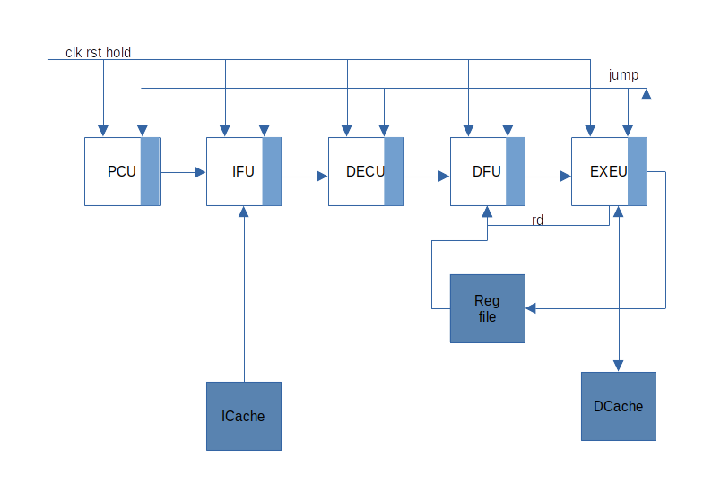

# riscv-5s
RISC-V core with 5 stage pipeline.

support RV32I.



## get started:

**OS：** <br>
Ubuntu 22.04

**install:** <br>
sudo apt install iverilog gtkwave

**download code:** <br>
git clone https://github.com/chenpeijun256/riscv-5s.git

**make:** <br>
cd riscv-5s/iver <br>
make <br>
make clean <br>

after make done, no failed case found, it's ok. <br>
```
total case: 38, failed: 0, success: 38.
```
